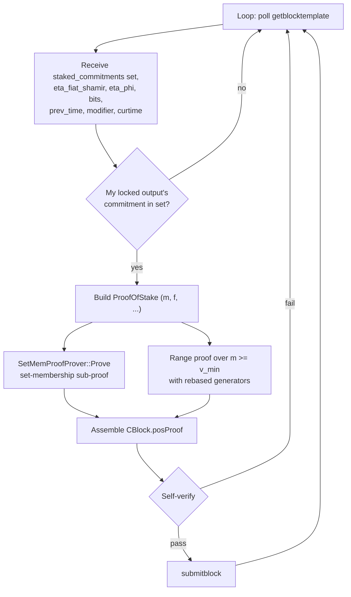

# Proof-of-Private-Stake (PoPS)

**PoPS** is Navio's BLSCT consensus mechanism on **mainnet** and **testnet** (and on `blsctregtest` for local development). Every PoPS block after the bootstrap PoW window is produced by a validator that proves three things in zero-knowledge:

1.  It controls an output in the current **staked commitment set** — without revealing which one.
2.  That output's hidden amount is large enough to satisfy the **Kernel-Hash eligibility** inequality at this block height.
3.  The proof is bound to this specific block (messages + prev-block state), so a valid proof cannot be replayed for a different block or grinded across stakers.

Unlike classical PoS, a PoPS block does **not** reveal:

-   Which UTXO was used to stake.
-   The staked amount.
-   Any link between successive blocks produced by the same staker.

Design paper (initial reference, shape differs in implementation):
[Navio: A Privacy-enhanced UTXO Blockchain (Dec 2025 draft)](https://nav.io). The implementation in [`nav-io/navio-core`](https://github.com/nav-io/navio-core/tree/master/src/blsct/pos) is the authoritative spec; this page documents what the code actually does.

---

## 1. Notation

| Symbol                                 | Meaning                                                                                          |
| -------------------------------------- | ------------------------------------------------------------------------------------------------ |
| $\mathbb{G}$                           | Prime-order group derived from BLS12-381's $G_1$ subgroup (via `Mcl` arithmetic backend).         |
| $p$                                    | Group order (255-bit prime).                                                                     |
| $\mathbb{F}_p$                         | Scalar field.                                                                                    |
| $G$, $H$                               | Two independent base generators. $G$ = `Point::GetBasePoint()`; $H$ = `deriver("proof-of-stake").Derive(G, 0, TokenId())` — nothing-up-my-sleeve, discrete log unknown. |
| $\{H_i\}_{i<N}$                        | $N = 2^{10}$ generator vector for the inner-product argument.                                     |
| $N$                                    | Maximum commitment-set size the setup supports (`SetMemProofSetup::N = 1024`).                    |
| $\mathbf{Y}^n = (Y_1, \dots, Y_n)$      | Staked commitment set at the tip of the parent block.                                             |
| $\sigma = h_3^m g_2^f$                 | Prover's own commitment being shown to lie in $\mathbf{Y}^n$.                                      |
| $(m, f)$                               | Committed value (stake amount) and blinding factor.                                                |
| $\varphi = h_3^m \cdot g_2^f$           | **Set element image** — re-randomised copy of $\sigma$ under fresh generators $(g_2, h_3)$.        |
| $\eta_{\text{FS}}$                     | Fiat-Shamir entropy tied to the parent block (prevents grinding).                                 |
| $\eta_\varphi$                         | Per-block seed that rebases the set-membership generators (binds the proof to block contents).    |
| $\text{KH}$                            | 32-byte kernel hash — lottery input, see §4.                                                       |
| $T_{\text{pos}}$                       | Compact PoS difficulty target (`nBits` of the new block).                                         |
| $v_{\min}$                             | Per-block minimum committed amount that satisfies the kernel-hash inequality (§4).                 |
| BLS12-381 generators for the Bulletproofs range proof are derived independently under the `TokenId()` path in `range_proof::GeneratorsFactory`. |

---

## 2. Staked commitment set

Validators lock stake by publishing a BLSCT transaction whose output is tagged as a **staked commitment**. Consensus maintains a set of all currently-unspent staked commitments in the UTXO view cache (`CCoinsViewCache::GetStakedCommitments`, [`src/coins.cpp`](https://github.com/nav-io/navio-core/blob/master/src/coins.cpp)).

-   An **unspent** staked commitment is flagged `STAKED_COMMITMENT_UNSPENT = 1`.
-   A **spent / unlocked** one is flagged `STAKED_COMMITMENT_SPENT = 0` and purged from the set.
-   The set is keyed by the raw Pedersen commitment point $Y_i = v_i H + \gamma_i G \in \mathbb{G}$. The set has no owner labels — observers only see a list of 48-byte group elements.
-   Consensus requires $|\mathbf{Y}^n| \ge 2$ to validate any PoPS block (`ProofOfStakeLogic::Verify` in [`src/blsct/pos/proof_logic.cpp`](https://github.com/nav-io/navio-core/blob/master/src/blsct/pos/proof_logic.cpp)). A single-commitment set would de-anonymise the staker.
-   Set size is padded to the next power of two with "dummy" points $H_5(\text{"SET\_MEMBERSHIP\_DUMMY"} \mathbin\Vert i)$ before the proof — dummies lie in $\mathbb{G}$ with unknown openings, so extension adds no malleability surface (see `SetMemProofProver::ExtendYs`).

### Minimum stake

| Network | `nPePoSMinStakeAmount`              |
| ------- | ----------------------------------- |
| mainnet | **10,000 NAV** (`10000 * COIN`)     |
| testnet | **10,000 NAV**                      |
| `blsctregtest` | **100 NAV**                  |

Source: `kernel/chainparams.cpp`. Plain `signet` and plain `regtest` are not PoPS chains in the current implementation.

### Block-production parameters

| Network        | `nPosTargetSpacing` | `nPosTargetTimespan` | `posLimit`               | `nBLSCTBlockReward` |
| -------------- | ------------------- | -------------------- | ------------------------ | ------------------- |
| mainnet        | **120 s**           | **3600 s**           | `0x0000ffffffffffff…`    | **8 NAV**           |
| testnet        | **60 s**            | **1800 s**           | `0x0000ffffffffffff…`    | **4 NAV**           |
| `blsctregtest` | **60 s**            | **1800 s**           | `0x0000ffffffffffff…`    | **4 NAV**           |

---

## 3. Set-membership proof (modified RingCT 3.0)

The set-membership sub-proof shows $\exists\, i^* \in [1, n]$ such that $Y_{i^*} = \sigma$, i.e. the prover's commitment lies in the published set, **without revealing $i^*$**. It is a custom modification of the RingCT 3.0 proof adapted for PoPS — the contributions are the **set-element image** $\varphi$ and the use of per-block $H_k$ hash families so the discrete log of the output point is not leaked.

### Prover procedure

From `SetMemProofProver::Prove` in [`src/blsct/set_mem_proof/set_mem_proof_prover.cpp`](https://github.com/nav-io/navio-core/blob/master/src/blsct/set_mem_proof/set_mem_proof_prover.cpp).

Let $\mathbf{b_L} = (b_1, \dots, b_n)$ with $b_{i^*} = 1$ and $b_i = 0$ otherwise; $\mathbf{b_R} = \mathbf{b_L} - \mathbf{1}^n$. These satisfy

$$
\mathbf{b_L} \circ \mathbf{b_R} = \mathbf{0}^n, \qquad
\mathbf{b_L} - \mathbf{b_R} = \mathbf{1}^n, \qquad
\langle \mathbf{b_L}, \mathbf{1}^n \rangle = 1.
$$

**Commit 1.** Compute

$$
h_2 = H_5(\mathbf{Y}), \qquad (g_2, h_3) = \text{GenFactory.Rebase}(\eta_\varphi).
$$

The comment in source explicitly notes: *"generators are swapped vs. paper — here $h_3 = G$ and $g_2 = H$"*. Pick $\alpha, \beta, \rho, r_\alpha, r_\tau, r_\beta \leftarrow \mathbb{F}_p$, vectors $\mathbf{s_L}, \mathbf{s_R} \leftarrow \mathbb{F}_p^n$ and compute

$$
\begin{aligned}
A_1 &= h_2^{\alpha} \cdot \mathbf{Y}^{\mathbf{b_L}} = h_2^{\alpha} Y_{i^*} \\
A_2 &= h_2^{\beta}\cdot \mathbf{h}^{\mathbf{b_R}} \\
S_1 &= h_2^{r_\alpha} h^{r_\beta} g^{r_\tau} \\
S_2 &= h_2^{\rho} \cdot \mathbf{Y}^{\mathbf{s_L}} \cdot \mathbf{h}^{\mathbf{s_R}} \\
S_3 &= h_3^{r_\tau} g_2^{r_\beta}.
\end{aligned}
$$

**Set element image.**

$$
\varphi = h_3^m g_2^f.
$$

Because $(g_2, h_3)$ are rebased from $\eta_\varphi$ (which commits to the block's transaction set — see §5), $\varphi$ is unlinkable to $\sigma$: two blocks staked by the same UTXO produce different $\varphi$, yet both validate against the same $\sigma \in \mathbf{Y}$.

**Challenge 1.** Fiat-Shamir transcript:

$$
\text{str} = \mathbf{Y} \mathbin\Vert A_1 \mathbin\Vert A_2 \mathbin\Vert S_1 \mathbin\Vert S_2 \mathbin\Vert S_3 \mathbin\Vert \varphi \mathbin\Vert \eta_{\text{FS}}.
$$

Derive $y, z, \omega \leftarrow H(\text{str})$.

**Commit 2.** Build degree-1 vector polynomials

$$
\begin{aligned}
\mathbf{l}(X) &= \mathbf{b_L} - z \cdot \mathbf{1}^n + \mathbf{s_L} \cdot X \\
\mathbf{r}(X) &= \mathbf{y}^n \circ (\omega \mathbf{b_R} + \omega z \mathbf{1}^n + \mathbf{s_R} X) + z^2 \mathbf{1}^n
\end{aligned}
$$

and the scalar polynomial $t(X) = \langle \mathbf{l}(X), \mathbf{r}(X) \rangle = t_0 + t_1 X + t_2 X^2$ where

$$
t_0 = z^2 + \omega(z - z^2)\langle \mathbf{1}^n, \mathbf{y}^n \rangle - z^3 \langle \mathbf{1}^n, \mathbf{1}^n \rangle.
$$

Pick $\tau_1, \tau_2 \leftarrow \mathbb{F}_p$ and commit:

$$
T_1 = g^{t_1} h^{\tau_1}, \qquad T_2 = g^{t_2} h^{\tau_2}.
$$

**Challenge 2.** $x = H_1(\omega, y, z, T_1, T_2)$.

**Response.**

$$
\begin{aligned}
\tau_x &= \tau_1 x + \tau_2 x^2 \\
\mu &= \alpha + \beta \omega + \rho x \\
z_\alpha &= r_\alpha + \alpha x \\
z_\tau &= r_\tau + f x \\
z_\beta &= r_\beta + m x \\
\mathbf{l} &= \mathbf{l}(x), \quad \mathbf{r} = \mathbf{r}(x), \quad t = \langle \mathbf{l}, \mathbf{r} \rangle.
\end{aligned}
$$

**Improved inner-product argument.** Instead of transmitting $\mathbf{l}, \mathbf{r} \in \mathbb{F}_p^n$ (size $n$), the prover runs the `ImpInnerProdArg::Run` protocol producing $\log_2 n$ left/right points $(L_i, R_i)$ and final scalars $a, b$. Challenge $c_{\text{factor}}$ is sampled before recursion to bind everything to the outer Fiat-Shamir stream.

The final proof:

$$
\pi_{\text{set}} = (\varphi,\ A_1, A_2, S_1, S_2, S_3, T_1, T_2,\ \tau_x, \mu, z_\alpha, z_\tau, z_\beta, t,\ \mathbf{L}, \mathbf{R}, a, b, \omega).
$$

Serialisation order is fixed in [`SetMemProof`](https://github.com/nav-io/navio-core/blob/master/src/blsct/set_mem_proof/set_mem_proof.h).

### Verifier equations

The verifier recomputes $y, z, \omega, x, c_{\text{factor}}$ from the transcript and rebuilds the four checks (see `SetMemProofProver::Verify`):

**(18) — polynomial identity**

$$
g^{t} h^{\tau_x} = g^{z^2 + \omega(z-z^2)\langle\mathbf{1}^n,\mathbf{y}^n\rangle - z^3 \langle\mathbf{1}^n,\mathbf{1}^n\rangle} \cdot T_1^{x} \cdot T_2^{x^2}
$$

**(19) — inner-product binding.** Encoded as a single multi-exponent over $\{A_1, A_2, S_2, h_2, \mathbf{L}, \mathbf{R}, G, \{G_i\}, \{H_i\}\}$; each $G_i, H_i$ exponent is derived via `ImpInnerProdArg::GenGeneratorExponents`. The check re-expresses

$$
A_1 A_2^{\omega} S_2^{x} h_2^{-\mu} \cdot \prod L_i^{x_i^2} R_i^{x_i^{-2}} \stackrel{?}{=} \mathbf{G}^{\vec{g}\text{-exps}} \mathbf{H}^{\vec{h}\text{-exps}} g^{(t - ab) c_{\text{factor}}}.
$$

**(20) — opening of $\sigma$ at $A_1$**

$$
h_2^{z_\alpha} h^{z_\beta} g^{z_\tau} \stackrel{?}{=} S_1 \cdot A_1^{x}.
$$

**(21) — opening of $\varphi$ at $S_3$** (the Navio-specific addition over RingCT 3.0)

$$
h_3^{z_\tau} g_2^{z_\beta} \stackrel{?}{=} S_3 \cdot \varphi^{x}.
$$

Equation (20) attests that $A_1$ opens to $(\alpha, f, m)$ over generators $(h_2, h, g)$. Equation (21) attests that $\varphi$ opens to the same $(m, f)$ over generators $(g_2, h_3)$. Combined, they prove that $\varphi$ commits to the *same* value and mask as the $\sigma$ hidden inside the set — without revealing which $Y_i$ it is.

### Why the rebase matters

$(g_2, h_3)$ are derived per block from $\eta_\varphi$. Two separate blocks staked by the same output produce two $\varphi$'s under different generator pairs; by the Decisional Diffie-Hellman assumption in $\mathbb{G}$, those two $\varphi$'s are indistinguishable from random and **cannot be correlated**. This is the source of the *coin unlinkability* property.

Formally (paper Definition 3): for random $x, y, z \in \mathbb{F}_p$,

$$
\Pr\left[\mathcal{A}(\mathbb{G}, g, g^x, g^y, h) = b \,\middle|\, b \leftarrow \{0,1\},\ h = \begin{cases} g^{xy} & b=0 \\ g^z & b=1 \end{cases}\right] \le \tfrac{1}{2} + \text{negl}(\lambda).
$$

---

## 4. Kernel-hash eligibility (range-proof leg)

Proving membership is necessary but not sufficient. A valid PoPS block must also satisfy the **eligibility inequality** parametrised by the kernel hash.

### Kernel hash

From [`src/blsct/pos/helpers.cpp`](https://github.com/nav-io/navio-core/blob/master/src/blsct/pos/helpers.cpp):

```cpp
// Bucket the staker-chosen time into POPS_TIME_GRANULARITY_SECONDS
// intervals. Caps per-slot grinding attempts.
static uint32_t BucketTime(const uint32_t& time) {
    return time - (time % POPS_TIME_GRANULARITY_SECONDS);  // 16 s
}

uint256 CalculateKernelHash(uint32_t prevTime, uint64_t stakeModifier, uint32_t time) {
    HashWriter ss{};
    ss << prevTime << stakeModifier << BucketTime(time);
    return ss.GetHash();
}

// Block-level kernel hash also binds parent chain work. Two forks that
// diverge from a common ancestor disagree on nChainWork immediately,
// so grinding effort against one fork does not carry to a parallel
// private branch rooted at the same ancestor.
uint256 CalculateKernelHashWithChainWork(
    uint32_t prevTime, uint64_t stakeModifier,
    const arith_uint256& prevChainWork, uint32_t time)
{
    HashWriter ss{};
    ss << prevTime
       << stakeModifier
       << ArithToUint256(prevChainWork)
       << BucketTime(time);
    return ss.GetHash();
}
```

So at the block level

$$
\text{KH} = H(\text{prevTime} \mathbin\Vert \text{stakeModifier} \mathbin\Vert \text{prevChainWork} \mathbin\Vert \text{bucket}_{16}(\text{time})).
$$

Every field a staker might grind is committed here. Combined with:

-   the **Fiat-Shamir entropy** $\eta_{\text{FS}} = H(\text{parentHash} \mathbin\Vert \text{parentStakeModifier})$,
-   the **time bucketing** (16-second quantisation),
-   the **chain-work binding**,

the grinding surface per slot is minimal. An attacker cannot rotate a candidate kernel hash without burning fresh work on the specific fork being extended.

### Minimum-value target

Let $T_{\text{pos}}$ be the current compact PoS target (`nBits` on the new block, derived by [`GetNextTargetRequired`](https://github.com/nav-io/navio-core/blob/master/src/blsct/pos/pos.cpp) via the same Bitcoin-style retarget math, timespan 30 min / spacing 60 s). Then

$$
v_{\min} = \text{SaturateToU64}\!\left(\left\lfloor \frac{\text{KH}}{T_{\text{pos}}} \right\rfloor\right).
$$

`ProofOfStake::CalculateMinValue` (in [`src/blsct/pos/proof.cpp`](https://github.com/nav-io/navio-core/blob/master/src/blsct/pos/proof.cpp)) returns the exact 256-bit quotient. `ProofOfStake::SaturateToU64` clamps to `UINT64_MAX` on overflow instead of silently truncating to the low 64 bits — closing a pathological-difficulty exploit where the truncated threshold would be easier than the true one. `ProofOfStakeLogic::Verify` additionally rejects blocks whose saturating `v_{\min}` exceeds the representable `CAmount` range, so the condition surfaces explicitly rather than falling through to a range-proof failure.

### Eligibility condition

The validator must prove

$$
v \ge v_{\min}
$$

where $v$ is its (hidden) committed stake amount in $\sigma$. A larger $v$ lowers the implicit probability bar, giving larger stakes a proportionally larger chance of landing a winning kernel hash — the familiar PoS lottery, but proved in ZK.

### Bulletproofs+ range argument

Implementation: `rangeProof = RangeProver.Prove(Scalars{m}, gamma_seed{f}, {}, eta_phi, min_value)` in `ProofOfStake::ProofOfStake`. A Bulletproofs++ range proof over commitment $\sigma$ proves

$$
v - v_{\min} \in [0, 2^{64}).
$$

The generators used by this range proof are rebased under $\eta_\varphi$ via `range_proof::GeneratorsFactory<T>::GetInstance(eta_phi)` — identical rebase as the set-membership proof. This ties the range proof to the block contents and defeats malleability.

Crucially, `rangeProof.Vs.Clear()` is called after proving: the commitment $V$ carried by a standard Bulletproof is stripped, because the verifier reconstructs $V = \varphi$ from the set-membership proof's output. The range proof proves "$v \ge v_{\min}$ for the value committed in $\varphi$" — not for a separate commitment.

### Verification

```cpp
ProofOfStake::VerifyKernelHash(range_proof, kernel_hash, next_target, eta_phi, setMemProof.phi)
```

1.  Compute $v_{\min}$ from $(\text{KH}, T_{\text{pos}})$.
2.  Attach $\varphi$ (from the set-membership proof) as the range proof's $V$.
3.  Run Bulletproofs+ verification with the provided $\eta_\varphi$-rebased generators.

---

## 5. Block-level bindings (anti-grinding, anti-malleability)

Two entropy inputs, both content-bound:

### `eta_fiat_shamir`

```cpp
blsct::CalculateSetMemProofRandomness(pindexPrev) {
    HashWriter ss{};
    ss << pindexPrev->GetBlockHash() << pindexPrev->nStakeModifier;
    return H(ss);
}
```

Binds the proof's Fiat-Shamir transcript to the *parent* block's hash + stake modifier. Cannot be changed without forking off a different ancestor.

### `eta_phi`

```cpp
blsct::CalculateSetMemProofGeneratorSeed(pindexPrev, block) {
    HashWriter ss{};
    ss << pindexPrev->nHeight
       << pindexPrev->nStakeModifier
       << TX_NO_WITNESS(block.vtx);
    return H(ss);
}
```

Binds $(g_2, h_3)$ — the rebase generators — to the block's **entire transaction list** (non-witness serialisation). The proof therefore signs the block. Any tampering with `vtx` changes $\eta_\varphi$, which changes $(g_2, h_3)$, which invalidates $\varphi$ and the range-proof generators simultaneously. This is the *"proof acts as a signature over the specific block"* clause in the paper.

### Stake modifier

`nStakeModifier` is a 64-bit value accumulated across historical PoS blocks; a staker cannot cheaply predict it ahead of time. `GetStakeModifierSelectionInterval` sums 64 sections using `MODIFIER_INTERVAL_RATIO = 3`. The same Bitcoin-PoS (ppcoin) style scheme; see `GetLastStakeModifier`, `GetStakeModifierSelectionIntervalSection` in [`pos.cpp`](https://github.com/nav-io/navio-core/blob/master/src/blsct/pos/pos.cpp).

---

## 6. Full verifier flow

From `ProofOfStakeLogic::Verify`:

1.  Load staked commitment set from the coins view at the **block's hash** — gets the set as it stood when the block was connected.
2.  **Reject** if set size < 2 (anti-deanonymisation).
3.  Recompute $\eta_{\text{FS}} = H(\text{prevHash} \mathbin\Vert \text{prevStakeModifier})$.
4.  Recompute $\eta_\varphi = H(\text{prevHeight} \mathbin\Vert \text{prevStakeModifier} \mathbin\Vert \text{TX\_NO\_WITNESS(vtx)})$.
5.  Recompute $\text{KH}$ and $T_{\text{pos}}$.
6.  Call `block.posProof.Verify(staked_commitments, eta_fiat_shamir, eta_phi, kernel_hash, next_target)`:
    -   Verify the set-membership sub-proof → returns `VALID` / `SM_INVALID`.
    -   Reconstruct the range proof with $\varphi$ as its value commitment and rebased generators; verify → `VALID` / `RP_INVALID`.

Both legs must pass. One call, two ZK sub-proofs, no revealed secrets.

---

## 7. Serialisation of `ProofOfStake`

On-chain block layout (see `primitives/block.h`):

```cpp
class CBlock : public CBlockHeader {
    blsct::ProofOfStake posProof;
    std::vector<CTransactionRef> vtx;
};
```

`posProof` serialises (in order):

| Field                  | Size      | Purpose                                |
| ---------------------- | --------- | -------------------------------------- |
| `setMemProof.phi`      | 48 B      | Set element image $\varphi$            |
| `setMemProof.A1`       | 48 B      |                                        |
| `setMemProof.A2`       | 48 B      |                                        |
| `setMemProof.S1`       | 48 B      |                                        |
| `setMemProof.S2`       | 48 B      |                                        |
| `setMemProof.S3`       | 48 B      |                                        |
| `setMemProof.T1`       | 48 B      |                                        |
| `setMemProof.T2`       | 48 B      |                                        |
| `setMemProof.tau_x`    | 32 B      |                                        |
| `setMemProof.mu`       | 32 B      |                                        |
| `setMemProof.z_alpha`  | 32 B      |                                        |
| `setMemProof.z_tau`    | 32 B      |                                        |
| `setMemProof.z_beta`   | 32 B      |                                        |
| `setMemProof.t`        | 32 B      |                                        |
| `setMemProof.Ls`       | var       | $\log_2 n$ IPA left points             |
| `setMemProof.Rs`       | var       | $\log_2 n$ IPA right points            |
| `setMemProof.a`, `b`   | 32 B × 2  | IPA final scalars                      |
| `setMemProof.omega`    | 32 B      |                                        |
| `rangeProof` (no `Vs`) | var       | Bulletproofs++, $V$ reconstructed from $\varphi$ |

For $n \le 1024$ (the `SetMemProofSetup::N` ceiling), $\log_2 n \le 10$ — the IPA is ~10 left + 10 right points. Typical `posProof` footprint: ~2.5 – 3 KB per block.

---

## 8. Cryptographic assumptions

From the paper and the `set_mem_proof` comments, soundness of PoPS relies on:

1.  **Discrete log hardness in $\mathbb{G}$** — protects the binding of Pedersen commitments and prevents forging $\sigma$ that opens to a value of the attacker's choice.
2.  **Decisional Diffie-Hellman (DDH) in $\mathbb{G}$** — protects coin unlinkability: $(g^x h^y, g^a h^b, g^{xa} h^{yb})$ is indistinguishable from $(g^x h^y, g^a h^b, g^c h^d)$, so a $\varphi$ cannot be correlated across blocks.
3.  **Bulletproofs++ soundness + zero-knowledge** — guarantees the range proof is sound ($v < v_{\min}$ cannot produce a valid proof) and ZK ($v$ is hidden).
4.  **EUF-CMA of BLS signatures** — used for all transaction-level authorisations that feed into the block and therefore into $\eta_\varphi$.
5.  **Random oracle model** — all hashes ($H$, $H_1, \dots, H_5$, kernel hash, Fiat-Shamir challenge extraction) are treated as random oracles. The $H_k$ families are deliberately constructed via `GenPoint(msg, k)` so the discrete log of their output is unknown.

---

## 9. Fork resolution

From paper §7.2.3, realised in the chain-selection logic:

> *"Validators measure the accumulation of PoS Target in a specific leaf to determine which one is the valid. Since a lower accumulated target implies a higher amount of staked coins, the consensus rules will select the divergent chain with the lower target from the candidates."*

Concretely the comparator is the same Bitcoin-like "most chain work" logic, with `nBits`-derived chain work summed across PoPS blocks (not PoW work). A chain backed by larger *hidden* stakes accumulates chain work faster; the ZK range proofs still prevent observers from seeing who those stakers are.

---

## 10. Staker workflow (`navio-staker`)



Code path: [`navio-staker.cpp`](https://github.com/nav-io/navio-core/blob/master/src/navio-staker.cpp), functions `GetStakedCommitments`, `GetBlockProposal`, and the `Loop` outer driver.

---

## 11. Security properties (what PoPS hides and what it does not)

| Property                                            | Status under PoPS                                            |
| --------------------------------------------------- | ------------------------------------------------------------ |
| Staked **amount** per validator                     | Hidden (Pedersen commitment, Bulletproofs range proof)       |
| Staker **identity** on a given block                | Hidden (set-membership proof)                                |
| Linkage **across** blocks by the same staker        | Hidden (DDH-protected $\varphi$ rebase per block)            |
| Total **number of active stakers**                  | Publicly visible (size of `stakedCommitments` set)           |
| Total **locked supply**                             | Publicly visible (sum over OP_LOCKSTAKE outputs' commitments is hidden, but count of staked outputs is not) |
| **Double-staking** protection                       | Enforced by UTXO set — a locked commitment is spent once it leaves the set, preventing a proof that reuses it against a later block (the commitment will no longer appear in $\mathbf{Y}$). |
| **Grinding** (trying many `nTime`'s)                 | Bounded by the kernel-hash target, same way as classical PoS; attacker still needs a valid `phi` with a real $m$.|
| **Long-range attacks**                              | Mitigated by weak-subjectivity checkpoints (paper §9 security considerations) — standard PoS-style assumption. |
| **Range-proof forgery** (fake $v \ge v_{\min}$)      | Computationally infeasible under Bulletproofs++ soundness.   |
| **Rogue-key attack** on aggregated BLS balance sig   | Prevented by signing the constant message `"BLSCTBALANCE"` combined with a valid Bulletproofs range proof; an attacker cannot forge without the secret mask. |

---

## 12. Consensus hardening rules

The following rules are part of the PoPS consensus design. Each closes a specific class of attack on the stake-eligibility, grinding, or long-range-attack surface and is gated per-network via `Consensus::Params::fPoPSHardened` (enabled on mainnet, signet, regtest, blsctregtest; disabled on testnet whose historical chain predates these rules). Slashing is out of scope for the current design and is tracked separately — see [Slashing (future work)](slashing.md).

### 12.1. Saturating `min_value` extraction

`ProofOfStake::CalculateMinValue` returns a 256-bit integer `KH / T_pos`. A naive narrowing to 64 bits via `GetUint64(0)` would silently wrap on overflow, producing an **easier** eligibility bound than intended — exploitable at pathologically tight `nBits`. PoPS therefore specifies `SaturateToU64`: values exceeding `2^64 − 1` clamp to `UINT64_MAX`. `ProofOfStakeLogic::Verify` additionally rejects blocks whose saturating `min_value` exceeds the representable `CAmount` range. No legitimate BLSCT commitment opens to a value in that regime, so the block is vacuously invalid; the explicit reject surfaces the condition directly instead of relying on downstream failures.

### 12.2. Grinding surface reduction

-   **Time bucketing.** `CalculateKernelHash` quantises the staker-chosen `block.nTime` into 16-second buckets (`POPS_TIME_GRANULARITY_SECONDS`). Per-slot grinding attempts drop by `60/16 ≈ 3.75×` with no meaningful effect on retarget dynamics.
-   **Chain-work binding.** `CalculateKernelHash(pindexPrev, block)` hashes `pindexPrev->nChainWork` alongside the other kernel inputs. Two forks diverging from a common ancestor disagree on `nChainWork` immediately, so grinding effort on one fork does not carry to a parallel private branch.

Both rules are active when `fPoPSHardened = true`; testnet (`fPoPSHardened = false`) runs the pre-hardening kernel to keep its historical chain valid.

### 12.3. Long-range-attack mitigation

Hard finality checkpoints in `Consensus::Params::finalityCheckpoints`. Any candidate whose block at a listed height disagrees with the baked-in hash is rejected regardless of accumulated chain work. Populated per-release from agreed hashes. Strictly additive to `nMinimumChainWork` / `defaultAssumeValid` — those handle weak subjectivity via cumulative work; checkpoints handle posterior-corruption attacks where leaked historical validator material could otherwise rewrite deep history.

### 12.4. Subgroup membership on G1 deserialization

`MclG1Point::SetVch` calls `mclBnG1_isValidOrder` after `mclBnG1_deserialize` on every G1 point it accepts. BLS12-381 G1 has a cofactor; curve membership alone does not imply prime-order-subgroup membership, and the discrete-log assumption only holds on the order-`r` subgroup. The check covers every deserialised G1 point — PoPS proofs, range proofs, signatures, public keys — with an explicit carve-out for the identity (the point at infinity is a valid BLSCT-commitment value).

Subgroup checks are the largest per-point cost in deserialisation, so the codebase additionally exposes `MclG1Point::SubgroupCheckDeferralScope`: within a scope, individual `SetVch` calls queue points; on scope exit, `BatchCheckSubgroup` validates the entire batch via a single random-linear-combination multi-exp. `ProofOfStake::Unserialize` uses this to amortise the tens-of-G1-points in a PoPS proof into one check without relaxing the rule.

### 12.5. Slashing (out of scope)

Slashing is not part of the current PoPS consensus rules. The codebase reserves `OP_SLASH_STAKE` (opcode + `SlashingWitness` struct + script-pattern recognition) so that future activation is a targeted upgrade rather than a redesign. Until then, consensus **rejects** any scriptSig matching the slashing-unlock pattern with `slashing-not-activated`. See [Slashing (future work)](slashing.md) for the intended construction (DLEQ-tagged nonces preserving coin unlinkability) and the activation roadmap.

### 12.6. Residual assumptions

The rules above close specific attack surfaces within the PoPS threat model. The following baseline assumptions remain — they are standard for PoS-class protocols and BLS-based privacy schemes, and nothing about PoPS uniquely strengthens or weakens them:

-   **CSPRNG.** Per-proof nonces are sampled from the OS RNG. Compromised randomness leaks the commitment opening via one-time exposure.
-   **Weak subjectivity.** New nodes must obtain a recent trusted hash to sync safely. Handled by `nMinimumChainWork` + `defaultAssumeValid` + `finalityCheckpoints`.
-   **Majority honest stake.** Chain-selection is "lowest accumulated target wins"; a majority of stake rewriting history trivially forks the chain. Matches the standard PoS assumption.
-   **Bulletproofs+ soundness / BLS EUF-CMA / DL + DDH on BLS12-381 G1.** The baseline hardness assumptions.

## Source tree

```
navio-core/
├── src/blsct/pos/
│   ├── pos.{h,cpp}            Kernel hash, retarget, stake modifier, entropy binding
│   ├── helpers.{h,cpp}        CalculateKernelHash
│   ├── proof.{h,cpp}          ProofOfStake class: combined (set-mem, range) proof
│   └── proof_logic.{h,cpp}    Create / Verify wrappers against CCoinsViewCache
├── src/blsct/set_mem_proof/
│   ├── set_mem_proof.h        SetMemProof struct on-chain layout
│   ├── set_mem_proof_setup.{h,cpp}   Domain-separated hash families, N=1024 generators
│   └── set_mem_proof_prover.{h,cpp}  Prove + Verify, improved inner-product argument
├── src/coins.{h,cpp}          CCoinsView::GetStakedCommitments, STAKED_COMMITMENT_* flags
├── src/validation.cpp         ConnectBlock → ProofOfStakeLogic::Verify
├── src/primitives/block.h     CBlock::posProof field
└── src/navio-staker.cpp       Staker daemon: polling, proof construction, submission
```

---

## See also

-   [Concepts → Consensus & supply](../concepts/consensus.md) — high-level overview.
-   [Node operator → Staking](../node/staking.md) — operational setup, `stakelock`/`stakeunlock`.
-   [BLSCT → Range proofs](range-proofs.md) — Bulletproofs++ primitives used here.
-   [BLSCT → Signatures](signatures.md) — BLS aggregation behind `BLSCTBALANCE` tx signatures.
-   Navio design paper: [*Navio: A Privacy-enhanced UTXO Blockchain*](https://nav.io) (Dec 2025 draft). Implementation in `navio-core` supersedes the paper where they diverge.
