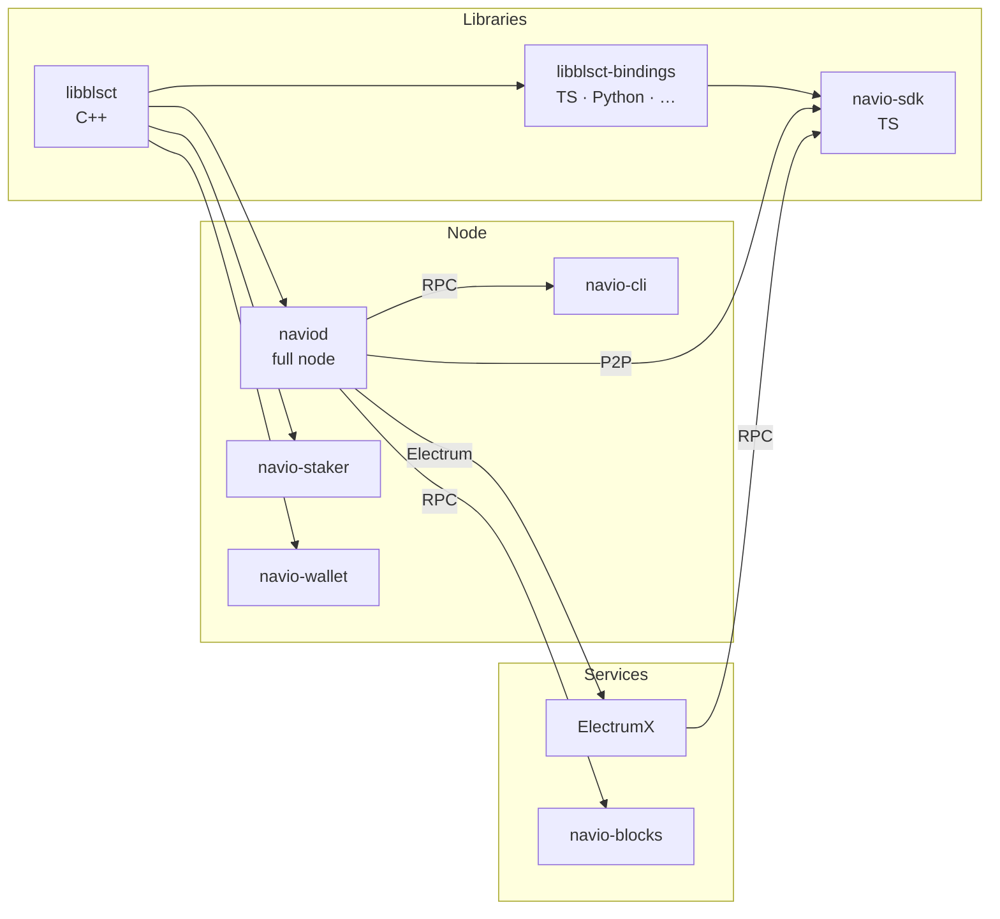

# Navio overview

**Navio** (ticker `NAV`) is a Layer-1 blockchain derived from the Bitcoin Core codebase with a privacy-preserving transaction protocol, **BLSCT** (BLS Confidential Transactions), at the base layer. It is the successor to Navcoin: the Navio mainnet launches with a migrated supply from Navcoin and replaces that chain's optional privacy layer with mandatory BLSCT for every transaction.

## Design goals

-   **Confidentiality by default.** Every mainnet transaction is BLSCT. Amounts, token balances, and the parties to a transaction are hidden from observers; only structural data (block, tx count, input/output cardinality, fees, script type) is public.
-   **Base-layer privacy.** Privacy is not an opt-in layer, a sidechain, a mixer, or a zk rollup. It is a property of the canonical ledger, enforced by consensus.
-   **Compatibility with Bitcoin tooling.** The node, RPC surface, networking, PoW cryptography, UTXO model, Merkle trees and P2P message framings are Bitcoin Core derivatives. Most operational knowledge ports directly.
-   **Efficient verification.** BLSCT uses aggregated BLS signatures and Bulletproofs++ range proofs, keeping per-block verification cost bounded.
-   **Private consensus.** Mainnet uses **Proof-of-Private-Stake (PoPS)**: stake weight is proven via set-membership proofs over Bulletproofs, so validators can prove they hold coins without revealing *which* coins they control.

## What is inherited from Bitcoin Core

-   **UTXO ledger** (with a Navio twist — see [outpoint model](outpoint.md)).
-   **Block framing** — header, Merkle root, witness commitment.
-   **P2P** — version handshake, `inv`/`getdata`/`block`/`tx`/`addr`, compact blocks, DNS seeding.
-   **RPC architecture** — JSON-RPC over HTTP, `navio-cli`, categories, cookie auth.
-   **Fee market** — mempool, package relay, RBF semantics.
-   **Wallet infrastructure** — BIP-32 HD derivation, BDB/SQLite wallet descriptors adapted for BLSCT keys.
-   **ZMQ, REST, Tor/I2P/CJDNS transports.**

## What is different

| Area                  | Navio                                                                                                                                               |
| --------------------- | --------------------------------------------------------------------------------------------------------------------------------------------------- |
| Amounts               | Hidden (Pedersen commitment) on BLSCT outputs. Only receiver and wallets holding the view key can recover them.                                     |
| Recipients            | [Double public keys](blsct-model.md#double-public-key) + stealth addresses. On-chain outputs never repeat keys; every output becomes unlinkable. |
| Curve                 | BLS12-381. Pairings enable signature aggregation and balance proofs.                                                            |
| Range proofs          | Bulletproofs++ prove each output's amount is in $[0, 2^{64})$ without revealing the value.                                                          |
| Signatures            | BLS aggregated signatures for transactions, balance proofs, and signed messages.
| Consensus             | Mainnet and testnet are BLSCT / PoPS networks after a short bootstrap PoW phase. Mainnet PoPS runs at 120-second spacing with 8 NAV steady-state rewards; testnet runs at 60-second spacing with 4 NAV rewards. Plain signet / regtest are non-BLSCT in the current chainparams; local BLSCT testing uses `-blsctregtest`. See [BLSCT → PoPS](../blsct/pops.md). |
| Outpoint identifier   | Single `output_hash` (32 bytes). Inputs reference outputs directly, not `txid:vout`.                                                                |
| Addresses             | Bech32m-encoded double public keys. Current node params use HRP `nav` on mainnet and `tnv` on testnet.                                              |
| Tokens and NFTs       | Native to BLSCT. Confidential amounts, on-chain metadata, unified inputs/outputs/commitments. See the [RPC reference](../rpc/tokens-nfts.md).       |
| Community fund        | **Removed** in the mainnet transition.                                 |

## Core components

## Where to go next

-   Want the crypto details? [BLSCT privacy model](blsct-model.md).
-   Running a node? [Install `naviod`](../node/install.md).
-   Integrating from an app? [SDK quickstart](../sdk/quickstart.md).
-   Indexing the chain? Read the [outpoint model](outpoint.md) — this is the single biggest thing that will break Bitcoin-derived tooling if you don't account for it.
