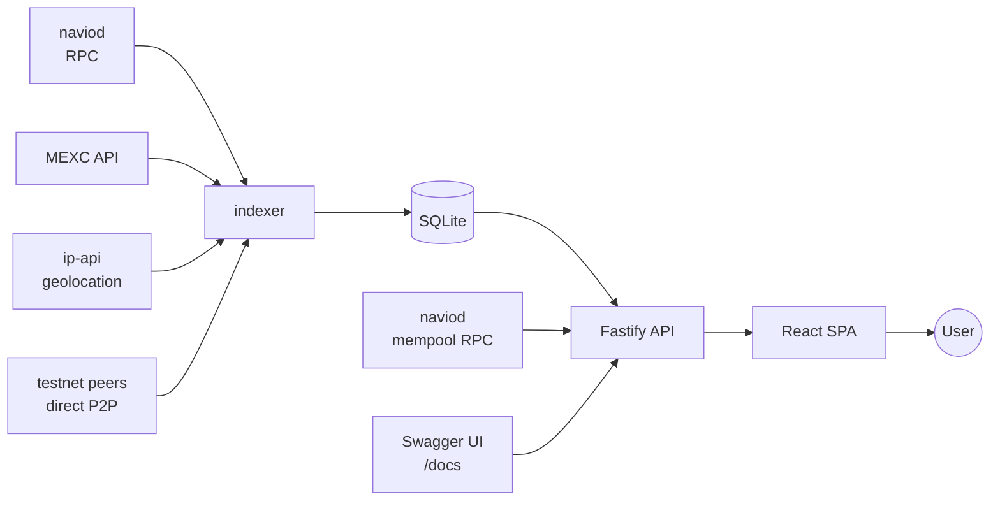

# Architecture

## Monorepo layout

```
navio-blocks/
├── packages/
│   ├── shared/        Shared TypeScript types
│   ├── indexer/       Polls naviod RPC → SQLite
│   ├── api/           Fastify REST API with Swagger
│   └── frontend/      React SPA with Tailwind
├── package.json       npm workspaces
└── navio-blocks.db    SQLite (created at runtime)
```

## Data flow



### Indexer {#indexer}

-   Polls `naviod` via JSON-RPC — new blocks, transactions, peers, mempool.
-   Fetches peer geolocation (ip-api) with local caching.
-   Fetches NAV price + 24h change (MEXC) — populates `price_history`.
-   Runs a direct-P2P peer crawler on testnet — `version`/`verack` + `getaddr` with bounded concurrency.
-   Computes per-block supply deltas (subsidy + fees − burn).
-   Writes to SQLite in WAL mode for safe concurrent reads.
-   Hot-reloads in dev via `tsx watch`.

### API {#api}

-   Fastify 5 with `@fastify/swagger` (OpenAPI 3.0) and `@fastify/static`.
-   Read-only routes over SQLite; live mempool and some chain queries proxied from `naviod`.
-   In production, serves the compiled frontend under `/` and API endpoints under `/api/*`, so a single port is exposed.
-   Swagger UI at `/docs`.

### Frontend {#frontend}

-   React 19 + Vite.
-   Tailwind CSS with a cyberpunk design system (dark navy + neon cyan/purple).
-   React Router 7 for navigation.
-   TradingView `lightweight-charts` for price/supply charts.
-   Dev server proxies `/api` to the API on port 3001.

## Why not use an existing explorer?

Bitcoin-derived explorers (Blockstream's `esplora`, Mempool.space's codebase, etc.) assume:

-   `txid:vout` outpoints.
-   Transparent amounts on every output.
-   Address-based queries.

Navio breaks all three assumptions (see [outpoint model](../concepts/outpoint.md) and [BLSCT privacy model](../concepts/blsct-model.md)). The explorer was purpose-built to display structural data without ever revealing confidential fields.

## Tech stack summary

| Layer        | Tools                                                                  |
| ------------ | ---------------------------------------------------------------------- |
| Monorepo     | npm workspaces                                                         |
| Indexer      | Node.js, TypeScript, better-sqlite3                                    |
| API          | Fastify 5, @fastify/swagger (OpenAPI 3.0), @fastify/static             |
| Frontend     | React 19, Vite, Tailwind CSS, React Router 7, lightweight-charts       |
| Shared types | TypeScript package, built before dependents                            |
