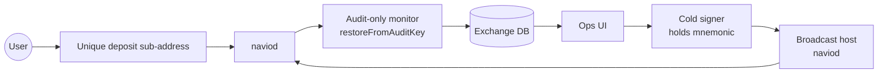

# Exchange integration

Integrating Navio into a custodial exchange. Covers deposit detection, cold-storage withdrawal signing, and reorg-safe bookkeeping.

## Architecture



Hot path: monitor detects deposits, credits balances.
Cold path: withdrawals signed on an air-gapped machine, broadcast via naviod.

## Deposit flow

### 1. Sub-address assignment

Per-user sub-addresses — one-to-one with exchange account IDs. The exchange pre-generates a pool:

```ts
// At user signup:
const { id } = client.getKeyManager().generateNewSubAddress(0); // account 0
const address = client.getKeyManager().getSubAddressBech32m(id, 'mainnet');
await db.users.update({ where: { id: userId }, data: { depositAddress: address, depositSubAddressId: id } });
```

Sub-addresses are free to generate and unlinkable on-chain — no reuse constraint. One per user per lifetime is fine.

### 2. Monitor service

Audit-only wallet (see [Build a watch-only audit wallet](audit-wallet.md)):

```ts
const monitor = new NavioClient({
    walletDbPath: '/var/lib/navio-monitor/wallet.db',
    electrum: { host: 'localhost', port: 50005 },
    restoreFromAuditKey: process.env.AUDIT_KEY,
    restoreFromHeight: LAUNCH_HEIGHT,
    network: 'mainnet',
});
await monitor.initialize();

// Pre-extend sub-address pool to match max users
for (let i = 0; i < 1_000_000; i++) {
    monitor.getKeyManager().generateNewSubAddress(0);
}

await monitor.startBackgroundSync({
    pollInterval: 10_000,
    onNewTransaction: onDeposit,
    onError: (err) => alert(`sync error: ${err.message}`),
});
```

### 3. Credit policy

```ts
async function onDeposit(txHash, outputHash, amount) {
    // idempotency — outputHash is unique per output
    const existing = await db.deposits.findUnique({ where: { outputHash } });
    if (existing) return;

    // identify which user via the hashId -> (account, index) table the SDK maintains
    const km = monitor.getKeyManager();
    const output = (await monitor.getAllOutputs()).find(o => o.outputHash === outputHash);
    if (!output) return;
    const hashId = km.calculateHashId(output.blindingKey, output.spendingKey);
    const subAddrRecord = await km.getSubAddressByHashId(hashId);
    const user = await db.users.findUnique({ where: { depositSubAddressIndex: subAddrRecord.id.address } });
    if (!user) {
        await db.orphanDeposits.create({ data: { outputHash, amount: amount.toString() } });
        return;
    }

    const tip = (await monitor.getChainTip()).height;
    const confirmations = tip - output.blockHeight + 1;

    await db.deposits.create({
        data: {
            userId: user.id,
            outputHash,
            txHash,
            amount: amount.toString(),
            confirmations,
            blockHeight: output.blockHeight,
            status: confirmations >= 6 ? 'credited' : 'pending',
            receivedAt: new Date(),
        },
    });
}
```

Every minute, rescan pending deposits:

```ts
async function advanceConfirmations() {
    const tip = (await monitor.getChainTip()).height;
    const pending = await db.deposits.findMany({ where: { status: 'pending' } });
    for (const d of pending) {
        const conf = tip - d.blockHeight + 1;
        if (conf >= 6) {
            await db.deposits.update({
                where: { outputHash: d.outputHash },
                data: { status: 'credited', confirmations: conf },
            });
            await creditUserBalance(d.userId, BigInt(d.amount));
        } else {
            await db.deposits.update({
                where: { outputHash: d.outputHash },
                data: { confirmations: conf },
            });
        }
    }
}
```

Confirmation threshold of 6 is a starting point; use higher for very large deposits.

## Reorg handling

The SDK sync manager rolls wallet state back on reorgs automatically — the audit wallet's `wallet_outputs` table reflects the new chain after the reorg. Your deposit records in the exchange DB don't — you must reconcile.

Pattern:

```ts
await monitor.startBackgroundSync({
    onNewBlock: async (height, hash) => {
        await db.blocks.upsert({ where: { height }, update: { hash }, create: { height, hash } });
    },
    // Catch reorgs by watching for hash changes at known heights
});

// Separate reorg detector:
setInterval(async () => {
    const tip = await monitor.getChainTip();
    const recent = await db.blocks.findMany({ where: { height: { gte: tip.height - 20 } } });
    for (const b of recent) {
        const actual = await monitor.getSyncProvider().getBlockHash(b.height);
        if (actual !== b.hash) {
            // reorg!
            await onReorg(b.height - 1);
            return;
        }
    }
}, 30_000);

async function onReorg(commonAncestorHeight) {
    const stale = await db.deposits.findMany({ where: { blockHeight: { gt: commonAncestorHeight } } });
    for (const d of stale) {
        await db.deposits.update({
            where: { outputHash: d.outputHash },
            data: { status: 'reorged' },
        });
        // un-credit if we had credited
        if (d.status === 'credited') await debitUserBalance(d.userId, BigInt(d.amount));
    }
}
```

Require high confirmations (≥ 30) before making funds withdrawable to external wallets to minimise the chance of a reorg surface.

## Withdrawal flow

### Cold signer

Physically air-gapped machine with the mnemonic. Never connected to the internet.

### Hot wallet

The exchange does not need a hot spending wallet at all if withdrawals are manually signed on the cold signer. For automation, keep a small hot balance in a separate wallet, with explicit per-tx approval gates.

### Signing workflow

1.  Hot service builds a raw BLSCT transaction (see [raw BLSCT tx guide](raw-blsct-tx.md)) paying out the batch of requested withdrawals, with the cold wallet's UTXOs as inputs. Uses the audit-key-derived view info to build commitments; does not need the spend key to build the unsigned tx.
2.  Exports the unsigned tx hex.
3.  Transfers via QR code / USB to the cold signer.
4.  Cold signer decodes, inspects, and signs with `signblsctrawtransaction` on a locally-running `naviod` with the real spend wallet.
5.  Signed tx returned to the hot side.
6.  Hot side broadcasts via `broadcastRawTransaction`.

### Per-withdrawal safety

-   Multi-operator sign-off in the ops UI before the cold signer receives the tx.
-   Hard cap on batch size.
-   Revert-on-mismatch: if the broadcast tx id differs from the signed tx id, halt and alert.

## Proof of reserves

BLSCT's [balance proofs](../blsct/range-proofs.md#balance-proofs-related-but-separate) enable cryptographic proof of solvency without revealing individual balances:

```bash
navio-cli createblsctbalanceproof <threshold_nav>
```

Publish the proof + the threshold. Anyone can verify with `verifyblsctbalanceproof` that the exchange controls at least that much NAV, without seeing specific UTXOs.

Iterate over multiple thresholds for more-informative proofs. Publish regularly (daily, weekly).
