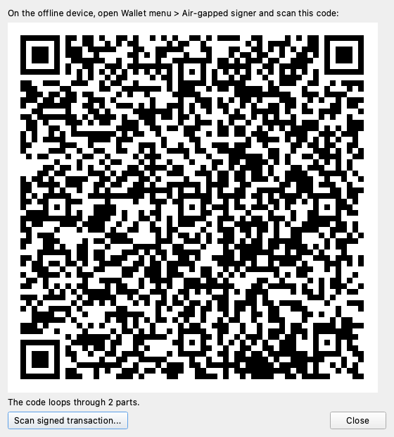
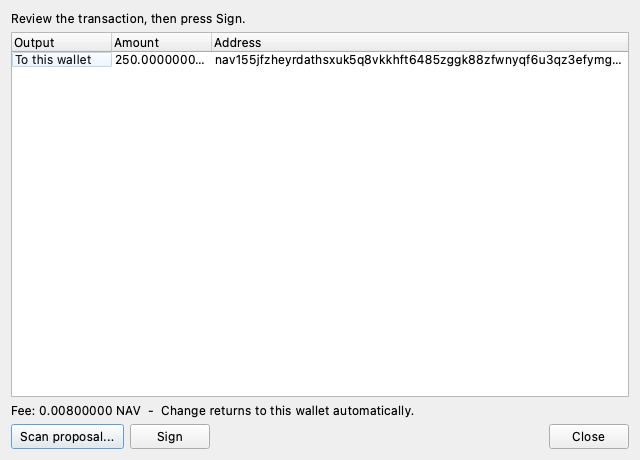
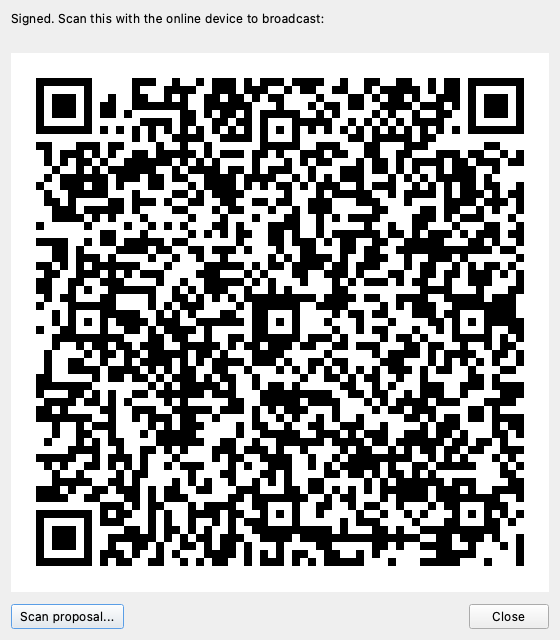
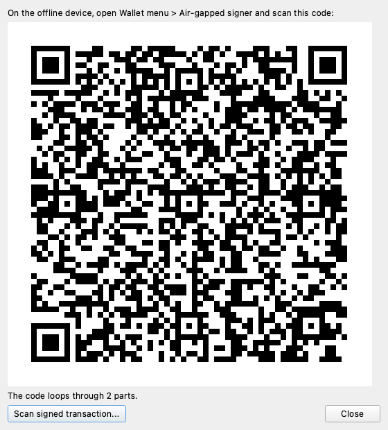

# Best-practice secure setup

Goal: the strongest self-custody configuration Navio supports, end to end. When you finish this guide:

- your **spending key** lives on a device that never touches the internet;
- your **everyday device** holds only a view key - it can watch, compose, and broadcast, but not spend;
- your **staking server** holds only a delegation key - it produces blocks but cannot touch the principal;
- every spend and every staking operation is reviewed and signed on the offline device, over QR codes.

No component of this setup can lose your funds on its own. The staking server can be hacked, the everyday phone can be stolen, and the principal stays behind the air gap.

| # | Step | Device |
|---|------|--------|
| 1 | [Set up the cold staking node](#1-set-up-the-cold-staking-node) | staking server |
| 2 | [Create the air-gapped spending wallet](#2-create-the-air-gapped-spending-wallet) | offline device |
| 3 | [Create the watch-only wallet from the view key](#3-create-the-watch-only-wallet) | everyday device |
| 4 | [Self-delegate for cold staking from the watch wallet](#4-self-delegate-for-cold-staking) | everyday + offline |
| 5 | [Spend from the cold wallet](#5-spend-from-the-cold-wallet) | everyday + offline |

You need: a server or VPS for staking (skippable if you will not stake), a spare phone or laptop with a camera for the air gap, your everyday phone or computer, and [Navio Electrum](https://github.com/nav-io/navio-electrum/releases/latest) **v4.9.3+** on the last two.

## 1. Set up the cold staking node

The staking box runs `navio-staker` with a *delegation key* - not a wallet. Follow [Run a staking node on a VPS](staking-vps.md) for the base install, then instead of loading a wallet:

```bash
# on the staking server: generate the delegation key pair
navio-staker -gendelegationkey
# -> writes /etc/navio/delegation.key and prints the public key

# keep the public key; you will delegate to it in step 4
```

Start the staker in delegated mode - it needs no wallet, no seed, nothing spendable:

```bash
navio-staker -delegated -delegationkeyfile=/etc/navio/delegation.key
```

Harden the box as usual ([node security](../node/security.md)). Worst case if it is compromised: the attacker produces blocks with your stake and can redirect *future* rewards until you redelegate. The principal is untouchable. Background: [Cold staking](../node/cold-staking.md).

## 2. Create the air-gapped spending wallet

Pick the device that will hold the spending key - an old phone or laptop is fine.

1. **Take it offline permanently.** Airplane mode on, Wi-Fi and Bluetooth off. Ideally do a factory reset first, install Navio Electrum from the APK/binary (transferred by USB or SD card), and never connect it again.
2. Open Navio Electrum, create a **new wallet**. Choose your network (mainnet).
3. **Write the seed on paper - all 26 words.** The last two words are the [wallet birthday](../concepts/wallet-formats.md#birthday-mnemonic-26-words): they encode the creation date so a future restore skips scanning older blocks. A restore with only the first 24 words still works, just slower. Two copies, two locations. The seed is the wallet; the device is just a signing tool. Optionally add a [BIP39 passphrase](wallet-cli.md) - anyone with the paper seed but not the passphrase gets an empty wallet.
4. Set a device PIN/password and an Electrum wallet password.

This wallet will show no history and never sync - that is the point. It only ever sees transactions as QR proposals you show to its camera.

## 3. Create the watch-only wallet

On the offline wallet, export the view key: **Wallet menu → View key**. It is displayed as a QR code and as 160 hex characters (`view_secret || master_spend_pubkey` - the same audit-key format `navio-core`'s `createwallet` accepts).

On your everyday device:

1. Create a **new wallet → Restore**.
2. Scan the view-key QR from the offline screen (or type the hex).
3. The wallet syncs and shows the full balance and history - but the app marks it watch-only and it holds nothing that can spend.

The view key is *semi-sensitive*: a leak reveals your history and balances, not your funds. Treat it like a bank statement, not like a seed.

From here on, your everyday device is the only one that needs the network, and the offline device is the only one that can sign.

## 4. Self-delegate for cold staking

Now connect steps 1-3: stake the funds watched by the online wallet, delegated to your own staking server, signed by the air-gapped wallet.

On the **watch-only wallet**: open **Staking → Stake**, enter the amount (minimum 10,000 NAV), and paste the **delegation public key** from step 1 into the delegation field. Because the wallet is watch-only, instead of asking for a password it displays the staking transaction as a looping QR sequence:



On the **offline device**: **Wallet menu → Air-gapped signer → Scan proposal**, and point the camera at the online screen until all parts are received. The signer rebuilds the transaction from its own keys and shows you exactly what will be signed - the staked amount, the delegation, the fee:



Press **Sign**. The signed transaction appears as a QR sequence:



Back on the **watch-only wallet**: **Scan signed transaction**, point it at the offline screen. It broadcasts, and your staking server starts producing blocks with the delegated stake.

Verify on the server logs or with `listdelegations` from any wallet-bearing node. Rewards arrive as ordinary confidential outputs to your wallet; the watch-only wallet sees them come in.

To move the delegation later (new server, rotated key), the same flow with `redelegatestake` semantics applies - one transaction, no staking gap, always signed behind the air gap.

## 5. Spend from the cold wallet

Spending follows the identical loop, so it is deliberately boring:

1. **Watch-only wallet:** enter address, amount, and optional memo as usual, press Pay. The proposal QR appears:

    

2. **Offline device:** Air-gapped signer → scan → **review every output and the fee on the offline screen**. This is the security boundary: the online device may be compromised, the offline screen cannot lie to you. Change never appears in proposals - the signer derives it from its own seed, so it cannot be redirected.
3. Press **Sign**, show the reply QR to the online device, done - it broadcasts.

Unstaking works the same way from the Staking page, as do token and NFT transfers.

## Habits that keep this secure

- **Read the offline screen before signing.** It is the only display an attacker cannot control. If an output or amount looks unfamiliar, press Close.
- **Never connect the offline device.** No "quick update over Wi-Fi". Update Navio Electrum on it via USB/SD when needed.
- **Paper seed, tested.** Restore the seed into a throwaway wallet once to confirm the backup works, then delete it.
- **Monitor delegations.** Check that rewards keep arriving; a hijacked staking box shows up as rewards drying up or going elsewhere. Redelegate immediately if so.
- **The watch wallet is disposable.** Phone lost or stolen: nothing is spendable. Restore the watch wallet on a new device from the view key and carry on.

## Related pages

- [Offline cold signing (air-gapped)](airgap-signing.md) - protocol details, trust model, wire format
- [Cold staking](../node/cold-staking.md) - how delegation works under the hood
- [Run a staking node on a VPS](staking-vps.md) - base server setup
- [Watch-only audit wallet](audit-wallet.md) - the same view-key mechanism, SDK-driven
